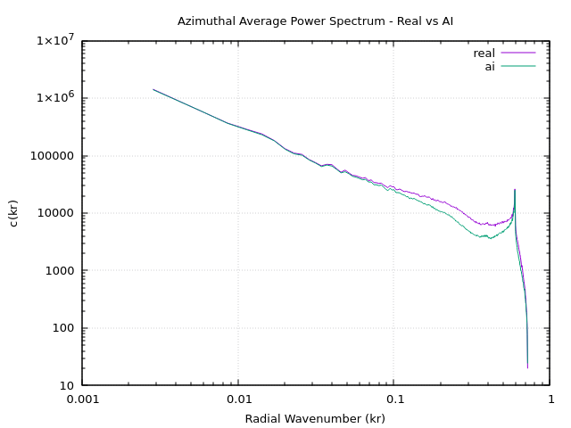

# Azimuthal Average Power Spectrum (AAPS) Analysis

## What is AAPS?
After computing the 2D FFT spectrum, we collapse it into a 1D curve by averaging
the magnitude of all frequency components at the same radial distance from DC.

This gives a rotation-scale, **frequency signature** of the image.

- **X axis (kr)** — normalized radial wavenumber `[0, 1]`. `kr=0` is DC (zero frequency), `kr=1` is the highest frequency (corner)
- **Y axis c(kr)** — average magnitude of all FFT values at radius `kr`

Based on:
> *Fourier Spectrum Discrepancies in Deep Network Generated Images*
> Dzanic et al., NeurIPS 2020

---

## Experiment

A real image was given to Gemini and it was asked to recreate the same image.
Both images are 700x525.

- `test_data/real/real.jpeg` — original real photo
- `test_data/ai/ai.png`     — Gemini recreation of the same image

### Graph Plot — Real vs AI

---

## Observations

### Low Frequencies (kr < 0.1)
- Both curves are **very much identical**, mostly overlapping.
- Gemini perfectly replicates the low frequency content of the image.
- This makes somewhat sense, low frequencies represent the overall structure and composition,
  which Gemini visually copied well.

### Mid to High Frequencies (kr > 0.1)
- The curves start to **diverge** from here, real image (purple) stays consistently higher.
- AI image (green) decays faster, carrying less energy at these frequencies.
- Does this means the real photo has **richer fine detail and texture** that Gemini didn't fully replicate?

### The Divergence Region (kr ~ 0.3 to 0.7)
- Most significant and consistent separation between the two curves was seen here.
- Real image has measurably **more high-frequency energy** throughout this range
- AI image is slightly **"smoother"** — natural high-frequency texture is missing

---

Even though Gemini produces visually convincing recreations that fool the eye,
the **frequency signature does not lie** — the real image consistently carries
more energy at mid-to-high frequencies (`kr > 0.1`).

This confirms the core claim of the paper:

> Deep network generated images share a systematic shortcoming in replicating
> the attributes of high-frequency modes.

Even modern models like Gemini show this discrepancy, just more subtly than
older GANs which showed obvious ring artifacts in the 2D spectrum, at the time the paper was written(2020).

---

## Next Step
- Extract parameters `b1` (magnitude) and `b2` (decay rate) as classification features.
- Power law
